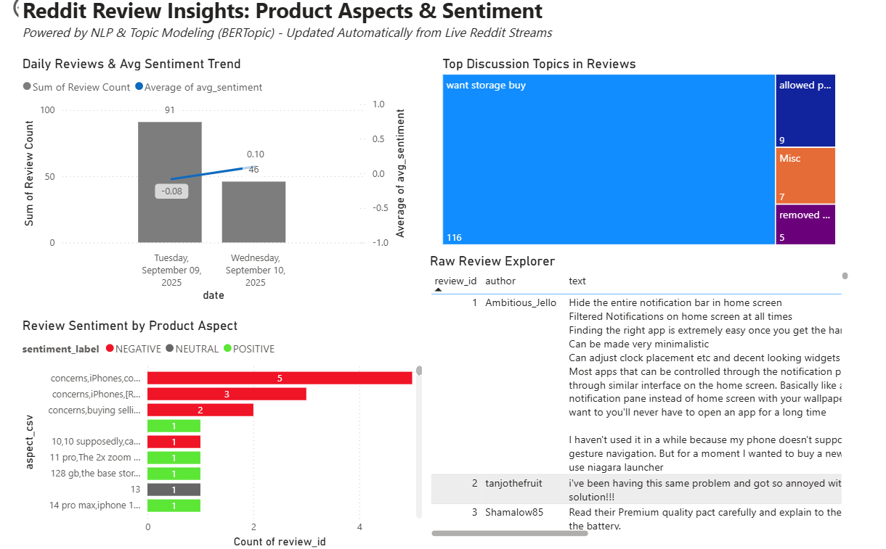

# 📊 Aspect-Sentiment BI

A **real-time Reddit ingestion + NLP pipeline** that extracts **aspects, sentiment, and topics** from product discussions, and powers an **interactive Power BI dashboard**.

---

## 🚀 Features
- 🔄 **Hybrid ingestion**: Backfills recent Reddit comments + streams live ones.
- 📝 **Aspect extraction**: KeyBERT + spaCy noun-chunking.
- 😃 **Sentiment analysis**: `cardiffnlp/twitter-roberta-base-sentiment-latest`.
- 🧩 **Topic modeling**: BERTopic with cleanup for meaningful clusters.
- 🗄️ **SQLite persistence**: Two tables:
  - `reviews_raw`: ingested comments.
  - `reviews_processed`: aspects, sentiment, topics.
- 📈 **Power BI dashboard**:
  - Daily review trends.
  - Aspect-level sentiment distribution.
  - Drill-down explorer of raw reviews.

---

## 📂 Project Structure
```
aspect-sentiment-bi/
│
├── realtime/               # Ingestion + processing pipelines
│   ├── ingest_reddit_stream.py
│   ├── hybrid_ingest_and_process.py
│   └── process_new_phase3.py
│
├── tools/                  # Export utilities
│   └── export_for_powerbi.py
│
├── src/                    # Database + ORM models
│   └── db_models.py
│
├── nlp/                    # Aspect + sentiment modules
│
├── requirements.txt        # Python dependencies
├── sample_reviews.csv      # Example dataset
└── README.md               
```

---

## ⚙️ Setup

### 1. Clone repo
```bash
git clone https://github.com/SwatiNeha/aspect-sentiment-bi.git
cd aspect-sentiment-bi
```

### 2. Create virtual environment
```bash
python -m venv .venv
source .venv/bin/activate   # (Linux/Mac)
.venv\Scripts\activate      # (Windows)
```

### 3. Install dependencies
```bash
pip install -r requirements.txt
```

### 4. Environment variables (`.env`)
```env
DATABASE_URL=sqlite:///data/aspect_reviews.db
REDDIT_CLIENT_ID=your_id
REDDIT_CLIENT_SECRET=your_secret
REDDIT_USER_AGENT=aspect-sentiment-bi/0.1
REDDIT_SUBREDDITS=iphone,Android,gadgets
REDDIT_KEYWORDS=battery,camera,screen,shipping,quality
```

---

## ▶️ Usage

### Ingest + Process Reddit data
```bash
python realtime/ingest_reddit_stream.py
```

### Export to CSV for Power BI
```bash
python tools/export_for_powerbi.py
```

### Automate end-to-end (Windows `.bat`)
```bat
@echo off
cd /d E:\Project\aspect-sentiment-bi-realtime
call .venv\Scripts\activate
python realtime\process_new_phase3.py
python tools\export_for_powerbi.py
pause
```

---

## 📊 Power BI Dashboard
- Daily reviews & sentiment trend.
- Aspect-level sentiment view.
- Top discussion topics.
- Raw review explorer (drill into comments).



---

## 🛠️ Development

### Run database migrations
```bash
python -m src.db_models
```

---

## 📌 Roadmap
- [ ] Add Docker setup.
- [ ] Deploy Power BI as shared workspace.
- [ ] Expand to other sources (Twitter, YouTube).

---

## 🤝 Contributing
1. Fork the repo
2. Create a branch: `git checkout -b feature/your-feature`
3. Commit: `git commit -m "Add your feature"`
4. Push: `git push origin feature/your-feature`
5. Open a Pull Request 🚀

---

## 📜 License
MIT License © 2025 [SwatiNeha](https://github.com/SwatiNeha)
