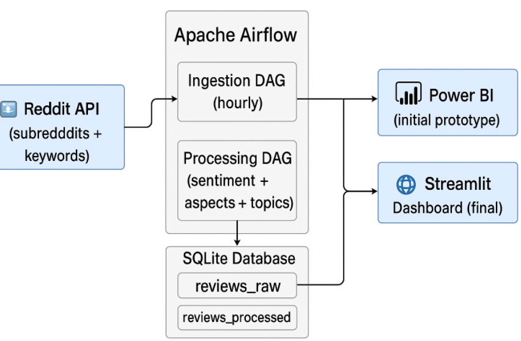
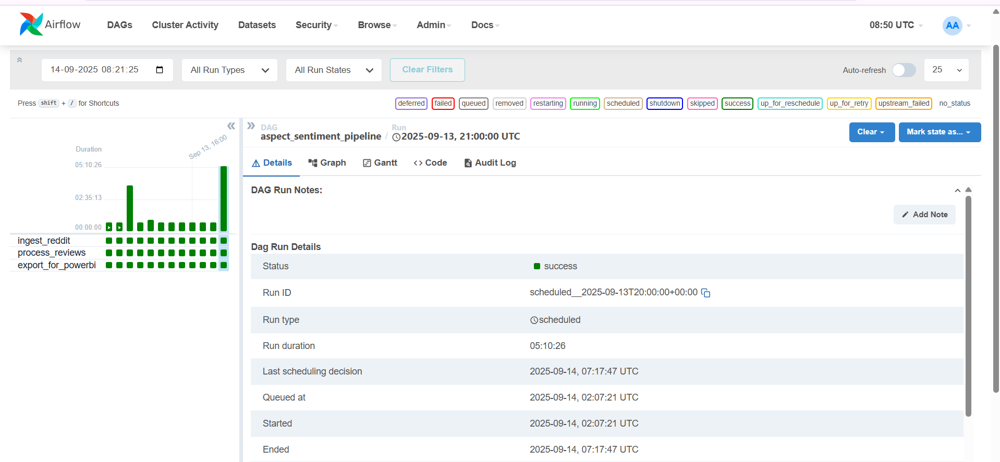
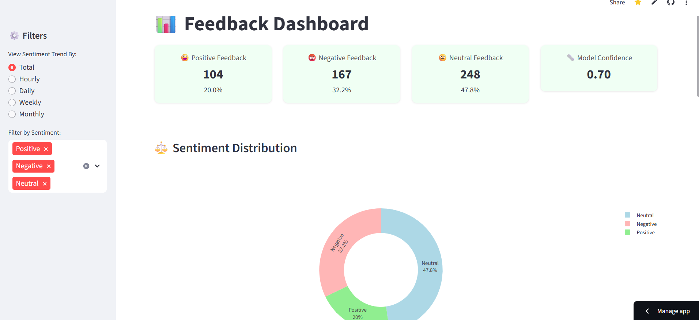
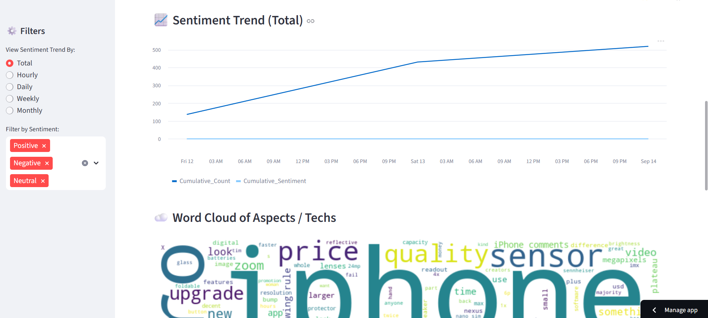
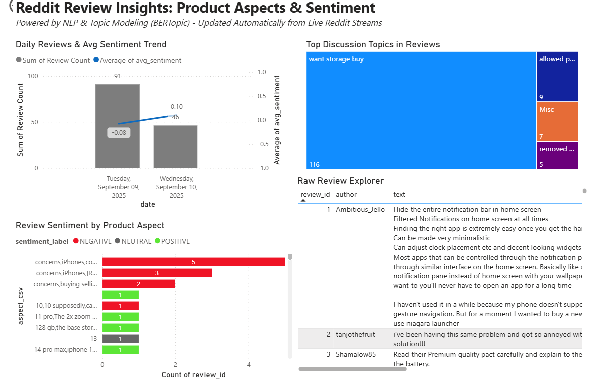

# 📊 Aspect-Sentiment BI

A **real-time Reddit ingestion + NLP pipeline** that extracts **aspects, sentiment, and topics** from product discussions, and powers an **interactive dashboard**.

 

---

## Features
- **Airflow Orchestration**: Pipelines run automatically on schedule (hourly).
- **Hybrid ingestion**: Backfills recent Reddit comments + streams live ones.
- **Aspect extraction**: KeyBERT + spaCy noun-chunking.
- **Sentiment analysis**: `cardiffnlp/twitter-roberta-base-sentiment-latest`.
- **Topic modeling**: BERTopic with cleanup for meaningful clusters.
- **SQLite persistence**: Two tables:
  - `reviews_raw`: ingested comments.
  - `reviews_processed`: aspects, sentiment, topics.
- **Dashboards**:
  - **Streamlit** (shareable, lightweight, interactive).
  - **Power BI** (local, richer visualization) -- I started with this: but then realized I cant publish it so stopped working on it and used Streamlit.
---

## Architecture

The project combines **Airflow (ETL)**, **SQLite (storage)**, and **Streamlit/Power BI (dashboards)**:



**Flow:**
1. **Reddit API** → Ingested via Airflow DAGs.
2. **Airflow** handles scheduling, retries, and log management.
3. Data lands in **SQLite DB** (raw + processed).
4. Dashboards:
   - **Streamlit** → Live, shareable, auto-refreshing.
   - **Power BI** → Local BI exploration.

---

## Why Streamlit (vs Power BI?)

Initially, Power BI was used, but it **wasn’t easily shareable** outside of a Pro workspace.  
To make the insights **accessible in real time without licensing barriers**, Streamlit was introduced.

- Open-source, easy to deploy.  
- Auto-refreshes with new pipeline runs.  
- Provides filters (sentiment, hourly/daily/monthly/total).  
- Complements Power BI by being web-shareable.

So the system supports **both**:
- **Power BI**: deeper analytics locally.  
- **Streamlit**: interactive and shareable online.

---

## 📂 Project Structure
```
aspect-sentiment-bi/
│
├── realtime/               # Ingestion + processing pipelines
│   ├── ingest_reddit_stream.py
│   ├── hybrid_ingest_and_process.py
│   └── process_new_phase3.py
│
├── tools/                  # Export utilities
│   └── export_for_powerbi.py
│
├── src/                    # Database + ORM models
│   └── db_models.py
│
├── nlp/                    # Aspect + sentiment modules
│
├── streamlit_app.py        # Streamlit dashboard
├── requirements.txt        # Python dependencies
├── sample_reviews.csv      # Example dataset
└── README.md               
```

---

## Setup

### 1. Clone repo
```bash
git clone https://github.com/SwatiNeha/aspect-sentiment-bi.git
cd aspect-sentiment-bi
```

### 2. Create virtual environment
```bash
python -m venv .venv
source .venv/bin/activate   # (Linux/Mac)
.venv\Scripts\activate    # (Windows)
```

### 3. Install dependencies
```bash
pip install -r requirements.txt
```

### 4. Environment variables (`.env`)
```env
DATABASE_URL=sqlite:///data/aspect_reviews.db
REDDIT_CLIENT_ID=your_id
REDDIT_CLIENT_SECRET=your_secret
REDDIT_USER_AGENT=aspect-sentiment-bi/0.1
REDDIT_SUBREDDITS=iphone,Android,gadgets
REDDIT_KEYWORDS=battery,camera,screen,shipping,quality
```

---

## Usage

### Run Airflow pipelines
```bash
airflow dags trigger aspect_sentiment_pipeline
```

### Run Streamlit dashboard
```bash
streamlit run streamlit_app.py
```

### Export CSV for Power BI
```bash
python tools/export_for_powerbi.py
```

---

## Dashboards

### Streamlit (shareable)
- KPI metrics (Positive/Negative/Neutral/Confidence).
- Sentiment distribution (donut chart).
- Sentiment trend (hourly, daily, weekly, monthly, total).
- Word cloud of aspects.
- Latest feedback table.

### Power BI (local - basic to test)
- Daily reviews & sentiment trend.
- Aspect-level sentiment view.
- Top discussion topics.
- Raw review explorer.

**Screenshots:**

- Airflow DAG →

 
- Streamlit →



- Power BI →
  

---

## Development

Run migrations:
```bash
python -m src.db_models
```

---

##  Roadmap
- [ ] Expand ingestion sources (Twitter, YouTube, Product Reviews).  

---

## Contributing
1. Fork the repo  
2. Create a branch: `git checkout -b feature/your-feature`  
3. Commit: `git commit -m "Add your feature"`  
4. Push: `git push origin feature/your-feature`  
5. Open a Pull Request  

---

## 📜 License
MIT License © 2025 [SwatiNeha](https://github.com/SwatiNeha)
